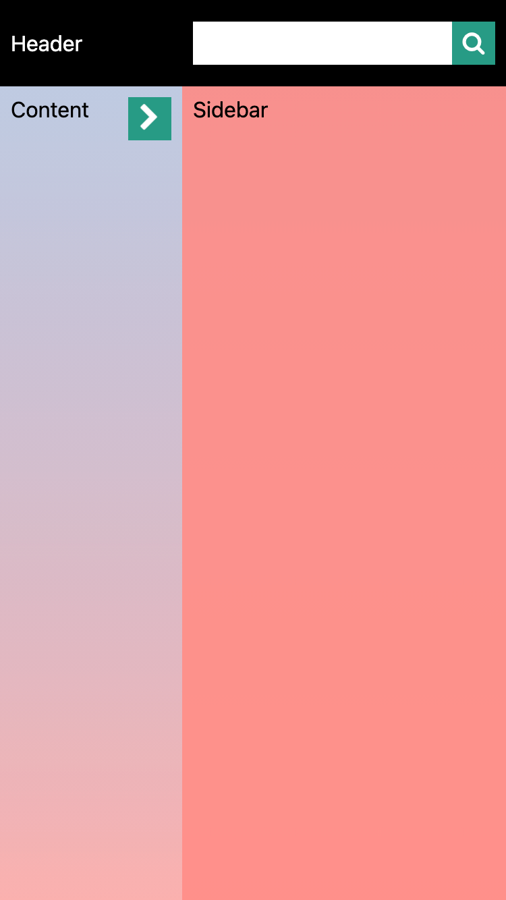

# BB-test

This is a beautiful business assessment.

# HTML/CSS knowledge check

> please ​give a brief description of the Box Model​ in your own words. Feel free to illustrate with examples from your experience.

In HTML, every element or section have a 'box', it contains four parts: margin, border, padding and content (from outer to inner). In css, when we talk about box model, there are several kinds of models. I will use two to explain this, one is content-box, the other is border-box. For content-box, if we need to get the width/height of the element, it will only calculate the content width/height; for border-box, the width/height of the element includes border, padding and content.

Here is an example:

`<div style='border: 1px solid black; padding: 2px; box-sizing: content-box'><div style='height:10px;width:10px'></div></div>`

`<div style='border: 1px solid black; padding: 2px; box-sizing: border-box'><div style='height:10px;width:10px'></div></div>`

if we use getBoundingClientRect().width/height to get the parent box size, for the first one, the answer will be width/height = 10px as it only calculate the content size, for the second one, the answer will be width/height = 10px + padding * 2 + border-width * 2 = 16px. So it is clear to see that sometimes a box's size depends on what kind of box it is.

# JS exercise

> 1. Return the sum of the price of all properties as a single value.

```
const getItemSoldTotalPrice = (sales) => {
  return sales.reduce((result, item) => result + item.price, 0).toFixed(2);
};
```

> 2. Return the items which were sold in 2017.

```
const getSoldItemsOfAYear = (sales, year) => {
  return sales.filter((item) => item.dateSold.includes(year));
};

getSoldItemsOfAYear(sales, '2017')

```

> 3. Return an array of all of the itemsSold properties as strings, sorted alphabetically.

```
const handleCaseInsensitiveSort = (strA, strB) => {
  return strA.toLowerCase().localeCompare(strB.toLowerCase());
};

const getSortedItemsSoldString = (sales) => {
  return sales.map((item) => item.itemSold).sort(handleCaseInsensitiveSort);
};
```

> 4. Using id as an argument, return the sale which matches the id.

```
const getPropertyById = (id, sales) => {
  return sales.find((item) => item.id === id);
};
```

Explanation:

- take sales array as arguments, so every function is a pure function.
- for case 3, add case insensitive sort, so it will ignore the character case and always out put the result alphabetically

# Replicate layout

- use VS code extension "Live Sass Compiler" to compile scss into css

  under Styles Folder:

  > style.scss: the overall style of the index.html
  > variables.scss: extract variables and defined in this file, so it is easy for maintenance and update
  > mixins.scss: put groups of css properties so that it can reusable in style.scss.

- there are three views here, for large desktop, small desktop, tablet and mobile

`large desktop`: To support more screen resolution, I set a safe content width of 1200px, so it enables most user browser the website correctly。  

`small desktop`: on small desktop content will fulfill the screen.

`tablet and mobile`: the sidebar will hide automatically, and there will be a button on the right top corner, Click the button will open or close the drawer;

 <div style='display:flex;width:500px;justify-content:space-between'>

 
 </div>
